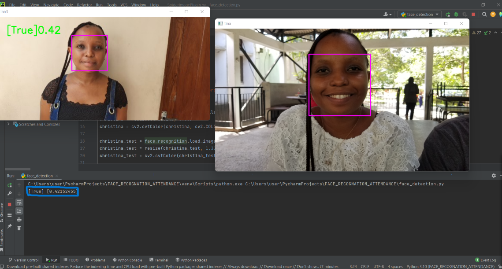
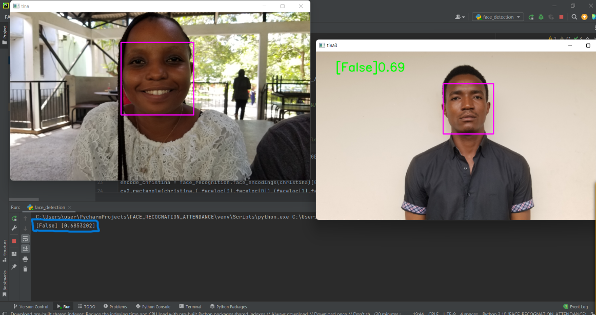

# FACE RECOGNITION ATTENDANCE SYSTEM

This is a Python-based facial recognition attendance system that uses OpenCV and the facial recognition library. The LBPH algorithm is used for face recognition.

## Table of Contents

- [Installation](#installation)

1. Clone the repository.

git clone https://github.com/Godie360/Facial_Recognition_Attendace_System

2. create the image sample in order to train the model

3. Install the required libraries.

```python
pip install -r requirements.txt
```

4. Run the "face_detection.py" script to detect the image.

```python
face_detection.py
```

- [Usage](#usage)

1.  Run the "face_attendance.py" script to start the facial recognition attendance system.

```python
face_attendance.py
```

2.  The system will detect and recognize faces in real-time using the LBPH algorithm.

3.  The system will automatically log the attendance of recognized faces in a CSV file named ATTENDANCE.CSV.

4.  To view the attendance report, open the "ATTENDANCE.CSV" file.

- [Contributing](#contributing)

Contributions to this project are always welcome! Please read the contributing guidelines before submitting a pull reques

## Usage

This Project is used to take attendance by detecting face, where by faces trained in this system inorder the system to recognize them then send the name and the time where
that person arrived

##

## Screenshot of the application where it try to detect two face which are similar and brought the result that is True

**

## Screenshot of the application where it try to detect two face which are different and brought the result that is False

\*\*

## Screenshot of the application where show the name and time where by the person arrive "The Attendance


## License

This project is licensed under the [MIT](https://opensource.org/licenses/MIT) license.

## Contributing

Contributions to the FACE RECOGNITION ATTENDANCE SYSTEM are welcome and encouraged! If you would like to contribute, please fork the repository and submit a pull request.

### Contact

[Email](https://github.com/Godie360) - godfreyenos360@gmail.com

[](https://twitter.com/Godfrey_360)
